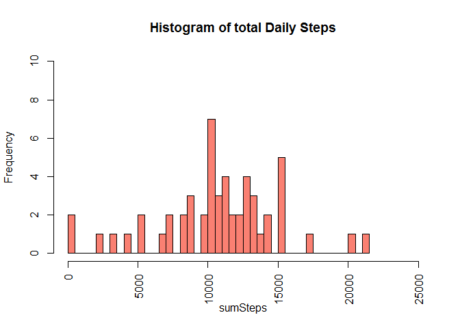
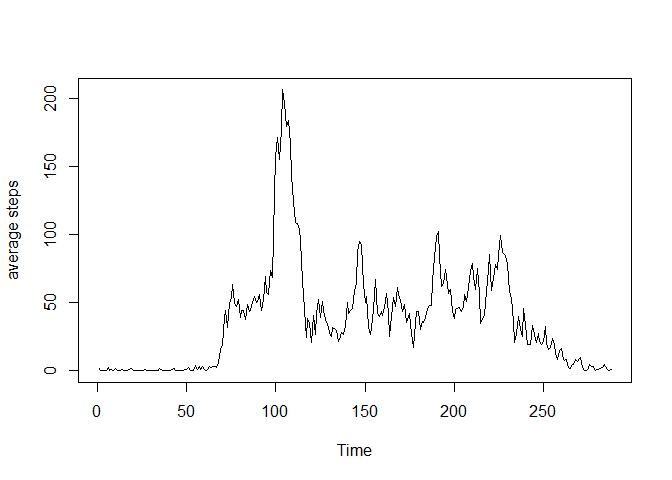
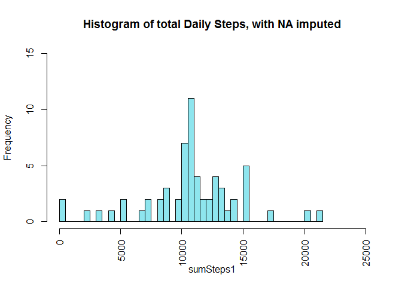
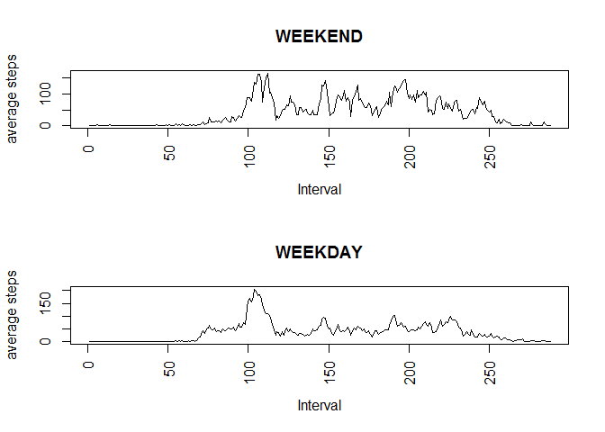

# Reproducible Research: Peer Assessment 1


## Loading and preprocessing the data
1. Load the data

```r
setwd("F:/Shared/Learning/DataScience/04 - Reproductible Research/Week2/PA1/RepData_PeerAssessment1")
download.file("http://d396qusza40orc.cloudfront.net/repdata%2Fdata%2Factivity.zip", "Factivity.zip", mode = "wb")
unzip("Factivity.zip")
rawD <- read.csv("activity.csv")
head(rawD)
```

```
##   steps       date interval
## 1    NA 2012-10-01        0
## 2    NA 2012-10-01        5
## 3    NA 2012-10-01       10
## 4    NA 2012-10-01       15
## 5    NA 2012-10-01       20
## 6    NA 2012-10-01       25
```

2. Process/transform the data (if necessary) into a format suitable for your analysis

```r
## Remove incomplete cases (rows where any information is missing)
c1 <- rawD[complete.cases(rawD), ]
head(c1)
```

```
##     steps       date interval
## 289     0 2012-10-02        0
## 290     0 2012-10-02        5
## 291     0 2012-10-02       10
## 292     0 2012-10-02       15
## 293     0 2012-10-02       20
## 294     0 2012-10-02       25
```

## What is mean total number of steps taken per day?
1. Calculate the total number of steps taken per day

```r
sumSteps <- tapply(c1$steps, c1$date, sum)
```
2. If you do not understand the difference between a histogram and a barplot, research the difference between them. Make a histogram of the total number of steps taken each day

```r
hist(sumSteps, breaks = 60, xlim = c(0,25000), ylim = c(0,10), col = "salmon", las=3, main = "Histogram of total Daily Steps")
```

 

3. Calculate and report the mean and median of the total number of steps taken per day

```r
meanSteps <- format(mean(sumSteps, na.rm = T), digits = 7, big.mark = ",")
medianSteps <- format(median(sumSteps, na.rm = T), digits = 7, big.mark = ",")
```
The mean daily steps is 10,766.19 steps and the median daily steps is 10,765 steps

## What is the average daily activity pattern?
1. Make a time series plot (i.e. type = "l") of the 5-minute interval (x-axis) and the average number of steps taken, averaged across all days (y-axis)

```r
tsd <- tapply(c1$steps, c1$interval, mean)
dff <- as.data.frame(tsd)
plot.ts(dff, ylab = "average steps")
```

 

2. Which 5-minute interval, on average across all the days in the dataset, contains the maximum number of steps?

```r
mas <- which.max(tsd)
intname <- names(tsd[mas])
themax <- tsd[mas]
```
The 5 minute interval which, in average, has the maximum number of steps is 835, which has in average 206.1698113 steps

## Imputing missing values
Note that there are a number of days/intervals where there are missing values (coded as NA). The presence of missing days may introduce bias into some calculations or summaries of the data.
1. Calculate and report the total number of missing values in the dataset (i.e. the total number of rows with NAs)

```r
allnas <- !complete.cases(rawD)
sumnas <- sum(allnas)
```
The dataset contains 2304 rows with NA values, which can introduce bias into some calculations or summaries of the data.

2. Devise a strategy for filling in all of the missing values in the dataset. The strategy does not need to be sophisticated. For example, you could use the mean/median for that day, or the mean for that 5-minute interval, etc.

```r
thenas <- rawD[allnas, ]
## what variables have NA values?
sum(is.na(thenas$steps)) # The variable 'steps' has 2304 missing values
```

```
## [1] 2304
```

```r
sum(is.na(thenas$date)) # The variable 'date' has no  missing values
```

```
## [1] 0
```

```r
sum(is.na(thenas$interval)) # The variable 'interval' has no  missing values
```

```
## [1] 0
```

```r
## The proposed strategy is to convert NA values to the mean of the corresponding interval
```

3. Create a new dataset that is equal to the original dataset but with the missing data filled in.

```r
dealtDS <- rawD
naIndex <- rownames(rawD[is.na(rawD$steps), ])
for(i in naIndex[1:length(naIndex)]) {
        dealtDS[i, "steps"] <- dff[as.character(dealtDS[i, "interval"]), ]
}
```

4. Make a histogram of the total number of steps taken each day and Calculate and report the mean and median total number of steps taken per day. Do these values differ from the estimates from the first part of the assignment? What is the impact of imputing missing data on the estimates of the total daily number of steps?

```r
sumSteps1 <- tapply(dealtDS$steps, dealtDS$date, sum)
hist(sumSteps1, breaks = 60, xlim = c(0,25000), ylim = c(0,15), col = "cadetblue2", las=3, main = "Histogram of total Daily Steps, with NA imputed")
```

 

```r
meandif <- mean(sumSteps, na.rm = T) - mean(sumSteps1,  na.rm = T)
meddif <- median(sumSteps, na.rm = T) - median(sumSteps1,  na.rm = T)
```
###The dataset had 2304 missing values, which where filled with the average for the corresponding 5 minute interval. After creating a new dataset with the filled values and calculating the mean and the median,  there was no difference between the mean of the new dataset and the mean from the original dataset,, but there was a diference of -1.1886792 when comparing the median of both datasets.

## Are there differences in activity patterns between weekdays and weekends?
1. Create a new factor variable in the dataset with two levels -- "weekday" and "weekend" indicating whether a given date is a weekday or weekend day.

```r
wkdDS <- dealtDS
wkdDS$weekday <- as.POSIXct(wkdDS$date)
wkdDS$weekday <- weekdays(wkdDS$weekday)
weekend <- unique(wkdDS$weekday)[c(6,7)]
wknd1 <- wkdDS[, "weekday"] == weekend[1]
wknd2 <- wkdDS[, "weekday"] == weekend[2]
wkdDS$isweekend <- wknd1|wknd2
head(wkdDS)
```

```
##       steps       date interval weekday isweekend
## 1 1.7169811 2012-10-01        0   lunes     FALSE
## 2 0.3396226 2012-10-01        5   lunes     FALSE
## 3 0.1320755 2012-10-01       10   lunes     FALSE
## 4 0.1509434 2012-10-01       15   lunes     FALSE
## 5 0.0754717 2012-10-01       20   lunes     FALSE
## 6 2.0943396 2012-10-01       25   lunes     FALSE
```
The variable "isweekend" in the dataset 'wkdDS' is a factor. For this variable, the question 'Is this day a weekend?' is answered either TRUE (saturday or Sunday) or FALSE (the weekdays: monday through friday)

2. Make a panel plot containing a time series plot (i.e. type = "l") of the 5-minute interval (x-axis) and the average number of steps taken, averaged across all weekday days or weekend days (y-axis). The plot should look something like the following, which was created using simulated data:


```r
allweekend <- wkdDS[wkdDS$isweekend==T, ]
allweekdays <- wkdDS[wkdDS$isweekend==F, ]
int.nd <- tapply(allweekend$steps, allweekend$interval, mean)
int.dy <- tapply(allweekdays$steps, allweekdays$interval, mean)
df.nd <- as.data.frame(int.nd)
df.dy <- as.data.frame(int.dy)
par(mfrow=c(2,1))
plot.ts(df.nd, xlab = "Interval", ylab = "average steps", main = "WEEKEND", las = 3)
plot.ts(dff, xlab = "Interval", ylab = "average steps", main = "WEEKDAY", las = 3)
```

 
